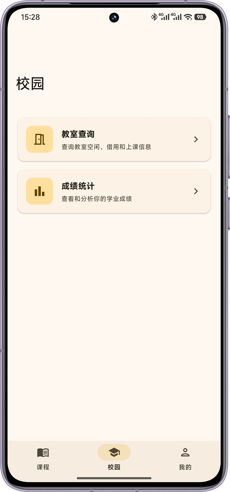
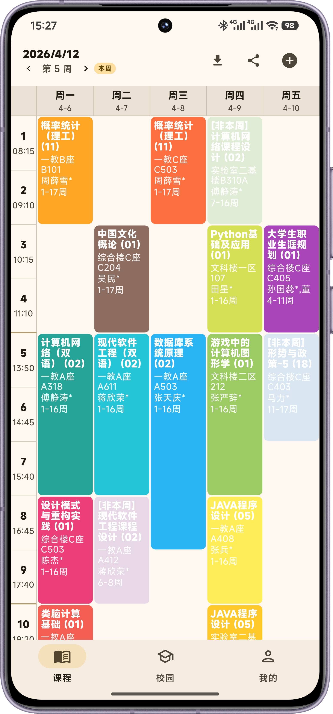
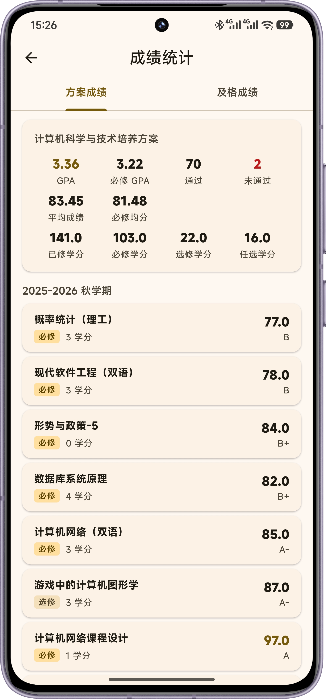

<div align="center">

# 🏔️ 不高山上 · Bugaoshan

[](https://flutter.dev)
[](https://dart.dev)
[](LICENSE)
[](https://flutter.dev)

> 川大学生专属校园助手

</div>

---

## 📖 背景

**不高山上**（Bugaoshan）是由 **The-Brotherhood-of-SCU** 团队开发的一款面向四川大学学生的校园助手 App。

"不高山"是江安校区的一处标志性地标，App 以此命名，寓意扎根校园、服务同学。

---

## ✨ 主要功能

- **课表管理** — 导入并查看个人课程表，清晰掌握每日课程安排
- **空闲教室查询** — 实时查询校园内各楼栋的空闲教室情况，方便自习选座
- **成绩统计** — 查看个人成绩，直观了解学业情况
- **更多便捷功能** — 持续迭代中，更多校园实用工具即将上线

<div align="center">
  
  &nbsp;&nbsp;&nbsp;
  
  &nbsp;&nbsp;&nbsp;
  
</div>

## 🚀 快速开始

**前往[Release页面](https://github.com/The-Brotherhood-of-SCU/Bugaoshan/releases)下载**

**或自行开发构建⬇️**

### 环境要求

- [Flutter SDK](https://flutter.dev/docs/get-started/install) >= 3.x
- [Dart SDK](https://dart.dev/get-dart) >= 3.x

### 安装运行

```bash
# 克隆仓库
git clone git@github.com:The-Brotherhood-of-SCU/Bugaoshan.git
cd Bugaoshan

# 安装依赖
flutter pub get

# 运行代码生成（DI & 国际化）
flutter pub run build_runner build --delete-conflicting-outputs

# 运行 App
flutter run
```

---

## 📁 项目结构

```
lib/
├── injection/            # 依赖注入（GetIt + Injectable）
├── l10n/                 # 国际化（ARB 文件及生成代码）
├── models/               # 数据模型
├── pages/                # 页面
├── providers/            # 状态管理
├── services/             # 业务逻辑与服务层
├── utils/                # 工具类与常量
├── widgets/              # 可复用 UI 组件
├── app.dart              # App 配置与主题
└── main.dart             # 入口
```

---

## 🛠️ 技术栈

| 类别 | 技术 |
|------|------|
| 框架 | [Flutter](https://flutter.dev) |
| 状态管理 | Provider / ChangeNotifier |
| 依赖注入 | [GetIt](https://pub.dev/packages/get_it) + [Injectable](https://pub.dev/packages/injectable) |
| 网络请求 | [Dio](https://pub.dev/packages/dio) + Cookie Manager |
| 本地存储 | [Hive CE](https://pub.dev/packages/hive_ce)、[SharedPreferences](https://pub.dev/packages/shared_preferences) |
| 国际化 | Flutter `flutter_localizations` |
| 国密算法 | [dart_sm](https://pub.dev/packages/dart_sm)（SM2/SM3/SM4） |

---

## 贡献

欢迎提交 Issue 和 Pull Request！

1. Fork 本仓库
2. 创建功能分支 (`git checkout -b feature/your-feature`)
3. 提交更改 (`git commit -m 'feat: add some feature'`)
4. 推送分支 (`git push origin feature/your-feature`)
5. 发起 Pull Request

---

## 团队

**The-Brotherhood-of-SCU** — 一个非官方的四川大学开源组织

---

## 许可证

本项目基于 [AGPL-3.0](LICENSE) 协议开源。
